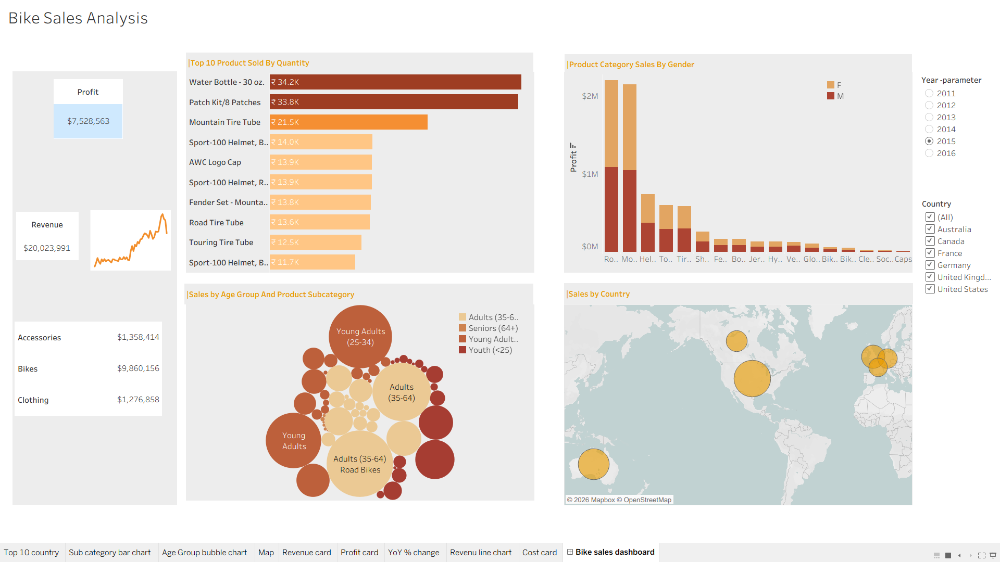

# 🚴 Bike Sales Analysis – Tableau Dashboard

An interactive **Bike Sales Analysis Dashboard** built using **Tableau** to analyze sales, profit, products, customer age groups, gender, and country-wise performance.

## 📊 Dashboard Preview



## 🎯 Project Overview

The **Bike Sales Analysis** project provides an interactive view of bike sales data and helps identify important business insights through visual analytics.

The dashboard includes key performance indicators, product analysis, customer segmentation, country-wise sales, and interactive filters for exploring the data.

## ✨ Dashboard Features

- 💰 **Profit Card** – Displays total profit.
- 💵 **Revenue Card** – Displays total revenue.
- 📈 **Revenue Trend** – Shows revenue variation over time.
- 🏆 **Top 10 Products Sold by Quantity** – Identifies the best-selling products.
- 👥 **Product Category Sales by Gender** – Compares sales/profit contribution between female and male customers.
- 🎯 **Sales by Age Group and Product Subcategory** – Visualizes sales distribution across customer age groups and product subcategories.
- 🌍 **Sales by Country** – Provides a geographic view of sales performance.
- 📅 **Year Filter** – Allows analysis for different years.
- 🌎 **Country Filter** – Allows users to select one or multiple countries.

## 📌 Key Dashboard Metrics

The dashboard provides an overview of:

- Total Revenue
- Total Profit
- Category-wise Sales
- Product-wise Sales
- Gender-wise Performance
- Age Group-wise Sales
- Country-wise Sales
- Year-wise Performance

## 🛠️ Tools & Technologies

- **Tableau** – Dashboard development and data visualization
- **Tableau Workbook (.twb)** – Project workbook
- **Data Visualization** – Charts, maps, KPI cards, and interactive filters

## 📂 Repository Structure

```text
Bike-Sales-Tableau/
│
├── tableua.twb
├── screenshots/
│   └── bike-sales-dashboard.png
└── README.md
```

## 🚀 How to Open the Project

1. Download or clone this repository.
2. Install **Tableau Desktop**.
3. Open the `tableua.twb` file in Tableau.
4. Open the **Bike sales dashboard** sheet.
5. Use the year and country filters to interact with the dashboard.

## 🔍 Dashboard Insights

The dashboard can be used to answer questions such as:

- Which products have the highest sales quantity?
- Which product categories generate the most revenue?
- How do sales differ between male and female customers?
- Which age groups contribute most to sales?
- Which countries have the highest sales performance?
- How does performance change from year to year?

## 🎓 Project Objective

The main objective of this project is to transform bike sales data into an interactive Tableau dashboard that makes business performance easier to understand and supports data-driven decision-making.

## 👩‍💻 Author

**Himanshi**

GitHub: [@himanshi482](https://github.com/himanshi482)

## 📄 License

This project is created for **educational and portfolio purposes**.
